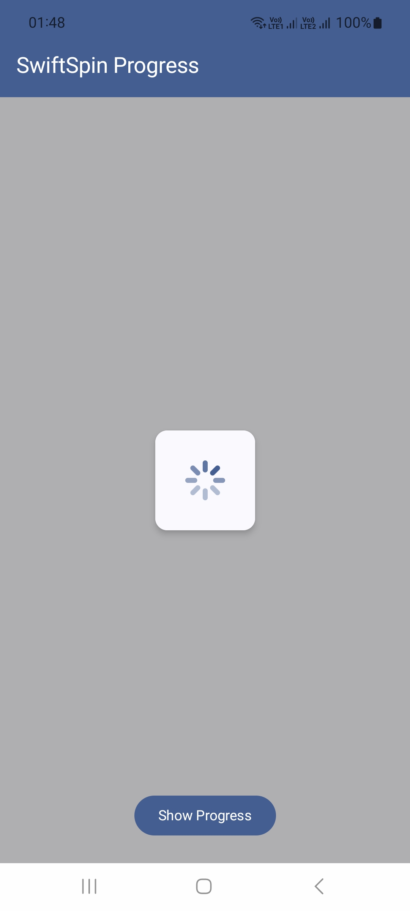
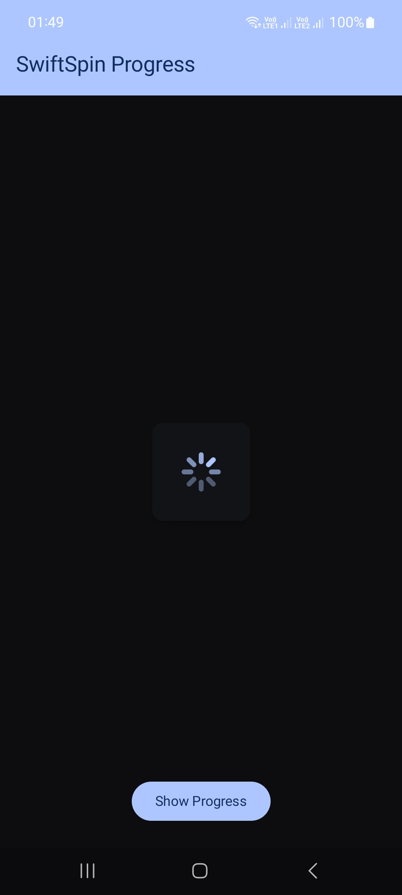
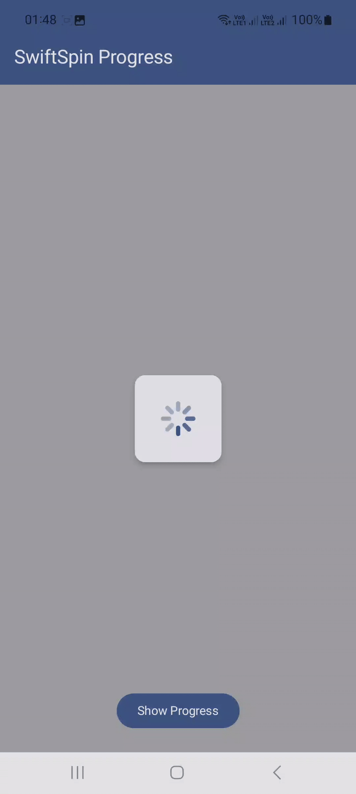
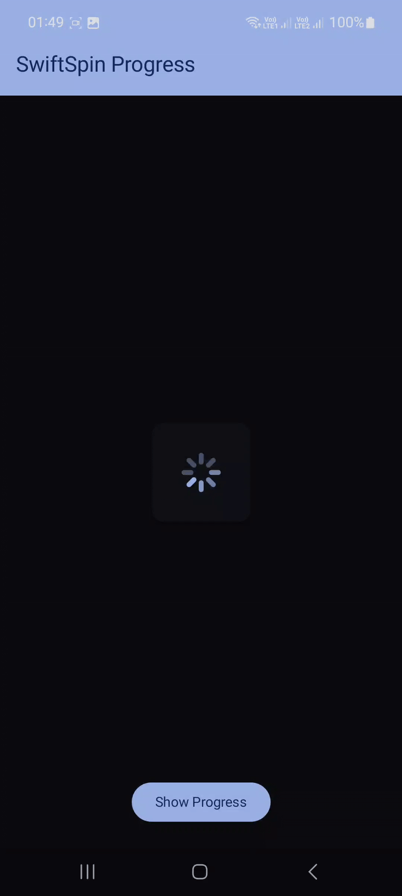

<h1 align="center">🌀 SwiftSpinProgress</h1>

<p align="center">
  <em>A lightweight, customizable iOS-style circular progress indicator for Android built with Jetpack Compose.</em>
</p>

<p align="center">
  <a href="https://search.maven.org/artifact/io.github.team2681/swiftspinprogress"></a>
  <a href="https://github.com/anilkumar2681/SwiftSpinProgress/main/LICENSE"></a>
  <a href="https://github.com/anilkumar2681/SwiftSpinProgress/stargazers"></a>
</p>

---

## ✨ Overview

**SwiftSpinProgress** is a modern, Jetpack Compose–based loading indicator inspired by iOS spinners.  
It offers smooth animations, easy customization, and a clean Material look — perfect for any Android app.

---

## 🎨 Features

- 🧩 **Composable-first** — plug directly into your Compose UI  
- ⚡ **Lightweight** — minimal setup and no external dependencies  
- 💫 **Smooth animations** with adjustable duration  
- 🎨 **Fully customizable** colors, shapes, and item counts  
- 🌗 **Dark/Light mode ready**

---

## Library Dependency

**The swiftspinprogress library is published on Maven Central.**

## Requirements

[//]: # (![collapsing bar]&#40;https://img.shields.io/maven-central/v/io.github.team2681/collapsingbar.svg&#41;)


Add this dependency to your **module-level** `build.gradle` file:

```kotlin
dependencies {
    implementation("io.github.team2681:swiftspinprogress:1.0.0")
}
```
**Using Version Catalog (libs.versions.toml)**

- Add this in your libs.versions.toml:

 ```
   [versions]
   swiftspinprogress = "1.0.0"

   [libraries]
   swiftspinprogressview = { group = "io.github.team2681", name = "swiftspinprogress", version.ref = "swiftspinprogress" }
   ```

- Then in your module build.gradle.kts:

   ```
   dependencies {
        implementation(libs.swiftspinprogressview)
   }
   ```

- Make sure mavenCentral() is included in your repositories:

   ```
   repositories {
        google()
        mavenCentral()
   }
   ```


## 🖼️ Preview

<table> <tr> 
<th style="text-align:center;">Light State</th>
<th style="text-align:center;">Dark State</th>
</tr>
<tr> 
<td></td> 
<td></td>
</tr> </table>

---
## 🖼️ Gif-Preview

<table> <tr> 
<th style="text-align:center;">Light State</th>
<th style="text-align:center;">Dark State</th>
</tr>
<tr> 
<td></td> 
<td></td>
</tr> </table>

---

## Usage

1. Clone this repo:

    ```bash
    git https://github.com/team2681/SwiftSpinProgress.git
    ```
2. Open in Android Studio.

3. Run on your device or emulator.

## Usage Example

```
@OptIn(ExperimentalMaterial3Api::class)
@Composable
fun SwiftSpinDemoScreen() {
    var showProgress by remember { mutableStateOf(false) }

    Scaffold(
        topBar = {
            TopAppBar(title = { Text("SwiftSpin Progress") })
        }
    ) { padding ->
        Box(
            modifier = Modifier
                .fillMaxSize()
                .padding(padding)
        ) {
            // Button at bottom center
            Box(
                modifier = Modifier
                    .fillMaxSize()
                    .padding(bottom = 24.dp),
                contentAlignment = Alignment.BottomCenter
            ) {
                Button(onClick = { showProgress = true }) {
                    Text("Show Progress")
                }
            }

            // SwiftSpin progress indicator
            SwiftSpinProgressView(
                isVisible = showProgress,
                spinnerBackgroundColor = MaterialTheme.colorScheme.surface,
                staticItemColor = MaterialTheme.colorScheme.primary.copy(alpha = 0.4f),
                dynamicItemColor = MaterialTheme.colorScheme.primary
            )

            // Auto-hide after 4 seconds
            LaunchedEffect(showProgress) {
                if (showProgress) {
                    delay(4000)
                    showProgress = false
                }
            }
        }
    }
}

```


## Parameters
<table> 
<tr> 
    <th>Parameter</th>
    <th>Type</th>
    <th>Default</th>
    <th>Description</th>
</tr>
 <tr>
    <td><code>modifier</code></td>
    <td><code>Modifier</code></td>
    <td><code>Modifier</code></td>
    <td>Used to modify the layout or behavior of the progress view. Commonly used to add padding, size, or alignment.</td>
  </tr>

  <tr>
    <td><code>isVisible</code></td>
    <td><code>Boolean</code></td>
    <td>—</td>
    <td>Controls the visibility of the progress view. When <code>true</code>, the spinner is shown; when <code>false</code>, it’s hidden.</td>
  </tr>

  <tr>
    <td><code>staticItemCount</code></td>
    <td><code>Int</code></td>
    <td><code>8</code></td>
    <td>Defines the total number of static items (spokes) in the spinner. Increasing this creates a denser spinner.</td>
  </tr>

  <tr>
    <td><code>dynamicItemCount</code></td>
    <td><code>Int</code></td>
    <td><code>staticItemCount / 2</code></td>
    <td>Defines how many of the spinner items are active (animated).</td>
  </tr>

  <tr>
    <td><code>spinnerBackgroundColor</code></td>
    <td><code>Color</code></td>
    <td><code>Color.Transparent</code></td>
    <td>Background color of the spinner’s inner area. Typically kept transparent.</td>
  </tr>

  <tr>
    <td><code>staticItemColor</code></td>
    <td><code>Color</code></td>
    <td><code>StaticItemColor</code></td>
    <td>Color of the non-animated (static) spinner items.</td>
  </tr>

  <tr>
    <td><code>dynamicItemColor</code></td>
    <td><code>Color</code></td>
    <td><code>DynamicItemColor</code></td>
    <td>Color of the animated spinner items that rotate.</td>
  </tr>

  <tr>
    <td><code>spinnerShape</code></td>
    <td><code>SwiftSpinShape</code></td>
    <td><code>SwiftSpinShape.RoundedRect</code></td>
    <td>Defines the shape of spinner items (e.g., RoundedRect, Circle).</td>
  </tr>

  <tr>
    <td><code>durationMillis</code></td>
    <td><code>Int</code></td>
    <td><code>1500</code></td>
    <td>Duration of one full spinner animation cycle, in milliseconds.</td>
  </tr>

  <tr>
    <td><code>backgroundOverlayColor</code></td>
    <td><code>Color</code></td>
    <td><code>Color.Black.copy(alpha = 0.3f)</code></td>
    <td>Semi-transparent overlay color shown behind the spinner (used to dim background).</td>
  </tr>

  <tr>
    <td><code>cornerRadius</code></td>
    <td><code>Dp</code></td>
    <td><code>12.dp</code></td>
    <td>Corner radius of the spinner’s card container. Controls roundness.</td>
  </tr>

  <tr>
    <td><code>spinnerContainerSize</code></td>
    <td><code>Dp</code></td>
    <td><code>100.dp</code></td>
    <td>Size of the spinner container card (width and height).</td>
  </tr>

  <tr>
    <td><code>spinnerCardElevation</code></td>
    <td><code>Dp</code></td>
    <td><code>4.dp</code></td>
    <td>Elevation (shadow depth) of the spinner card for visual depth.</td>
  </tr>

</table>

## WhatsApp Channel

Get Kotlin & Android Jetpack Compose tips on `What's App` **Join My Channel** :
[📚 Kotlin & Android Learning📚](https://whatsapp.com/channel/0029VbBGTNr90x2umLoWKU3z)

## License


This project is licensed under the Apache License 2.0.

See the full license [here](LICENSE.txt).